# 关于NeoOS的一个README
NeoOS是一个主要使用rust进行编写的操作系统，主要用于改写为操作系统实验。现在将对本系统进行一些简要的介绍。
## 一些文档
### 参赛文档
[NeoOS-设计说明文档](NeoOS-初赛文档.pdf)
### NeoOS的文档
关于实验内容，我们准备了一些文档用于说明和参考。

执行以下命令
```shell
mdbook serve zh
```
之后浏览器打开输出的地址进行查看。

当然，在本仓库之中，我们已经提供了原始的md文件：

[中文实验辅助文档](https://gitlab.eduxiji.net/202310055111481/project1466467-176483/-/tree/main/doc/zh)

[英文实验辅助文档](https://gitlab.eduxiji.net/202310055111481/project1466467-176483/-/tree/main/doc/en)

可以分别进入对应的文件夹，然后使用 `mdbook` 进行实验文档查看。

## 仓库布局
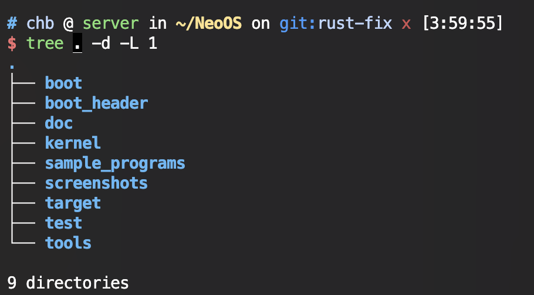

仓库中有如图所示的9个文件夹，较为关键的是boot、boot_header、kernel这三个文件夹。下面分别进行介绍。
### boot
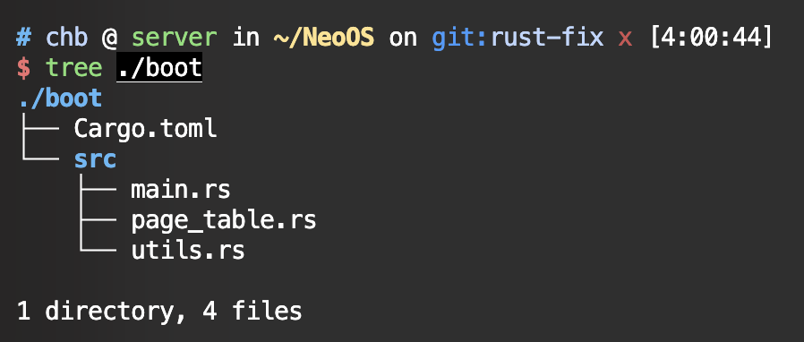

在boot文件夹中共有四个文件。其主要功能是通过UEFI启动内核，同时有一些UEFI启动器，并进行以下操作：
* 从磁盘读取内核镜像
* 读取物理内存信息，并构建页帧分配器
* 构建初步的页表
* 对内核各个section、内核栈、BIOS等物理地址进行映射
### boot header
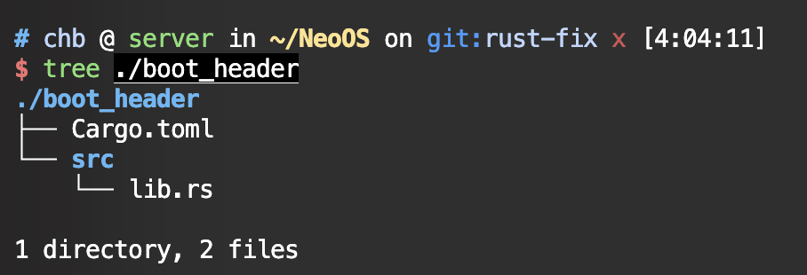

在boot header中有两个文件，主要定义了bootloader探测到的一些配置信息，之后将这些信息传递给内核。
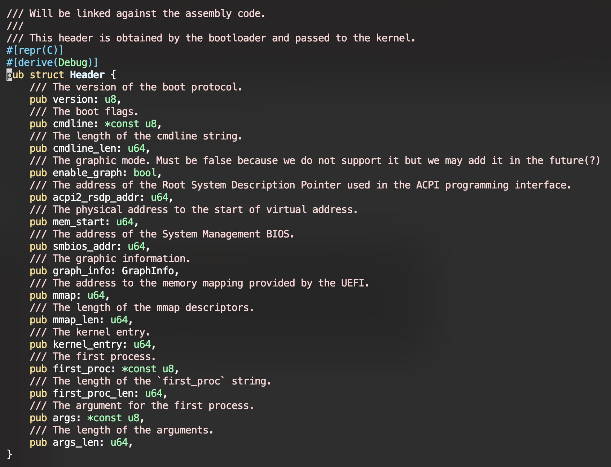

### kernel
kernel可以说是NeoOS的核心，下面对整个kernel进行简要分析。
#### 内核启动全流程


内核启动的大致流程
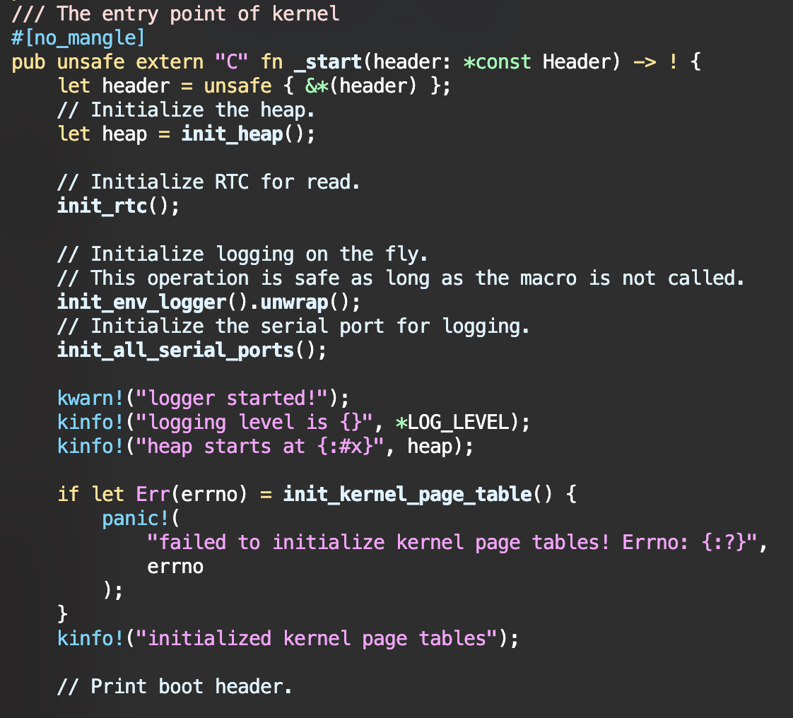

以上代码定义于kernel/src/arch/x86_64/boot/mod.rs，其中的每一步都以函数调用的形式完成。下面进行关键步骤的分析。

* 堆初始化 init_heap()
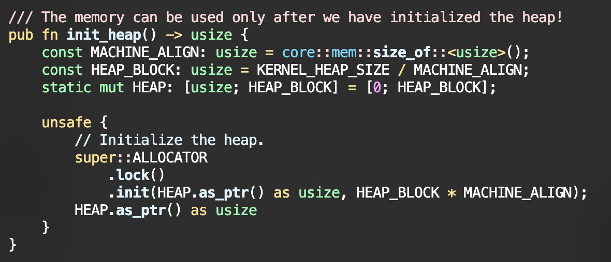   
 
该段代码定义于kernel/src/memory.rs。通过指定了一块bss区域作为初始堆的起始地址，该区域通过ld脚本实现，该脚本制定了bss所在的虚拟地址。由于在bootloader阶段已经把bss区域映射到了虚拟地址，所以可以进行直接访问。
* 物理内存初始化 init_mm()
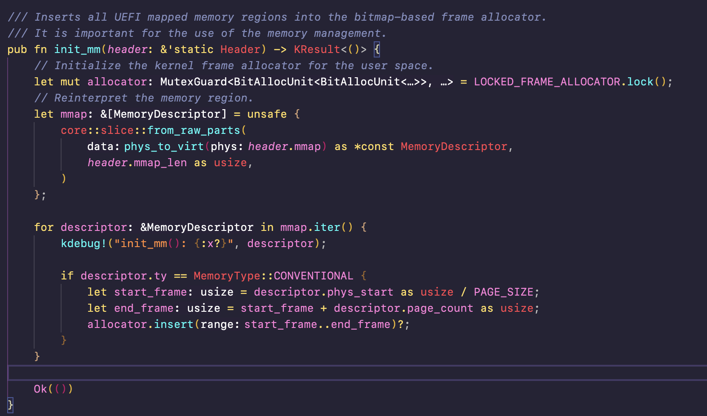

该段代码定义于kernel/src/arch_x86_64/mm/paging.rs。将bootloader读取到的物理内存信息进行存储，之后将这些信息传递给物理页帧分配器用于给之后的内存分配做准备。
* 终端初始化 init_interrupt_all()
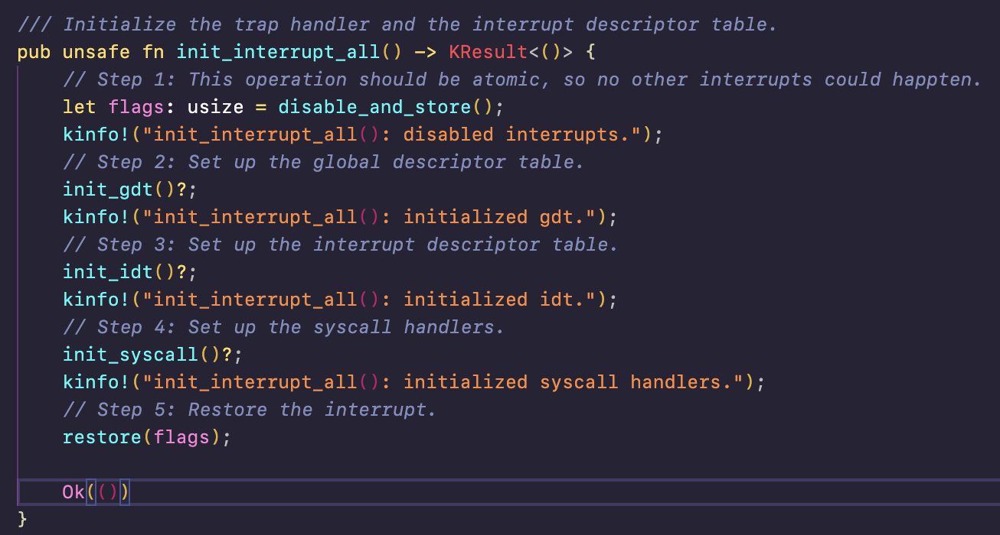

该段代码定义于kernel/src/arch_x86_64/intrrupt/mod.rs。<br>
1)disable_and_store：暂时关闭中断。<br>
2)init_gdt：初始化全局描述符表。<br>
3)init_idt：初始化中断向量表。<br>
4)init_syscall：初始化syscall相关寄存器用以快速syscall。<br>
5)restore：启动中断。<br>
6)中断涉及权限切换，需要用汇编手动实现，相关代码在同目录下的.S中。
* CPU初始化 init_cpu()
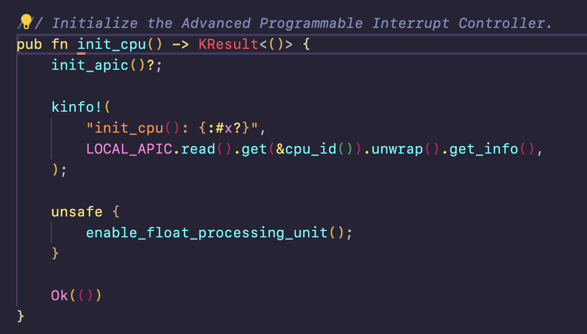

该段代码定义于kernel/src/arch_x86_64/cpu.rs。<br>
1)init_apic：启动Advanced Programmable Interrupt Handler 用于初始化各个核心的中断处理器。APIC的具体功能和实现请查询wiki<br>
2)enable_float_processing_unit：启动浮点单元，启动后可以计算浮点数。
* PCI总线初始化 init_pci()
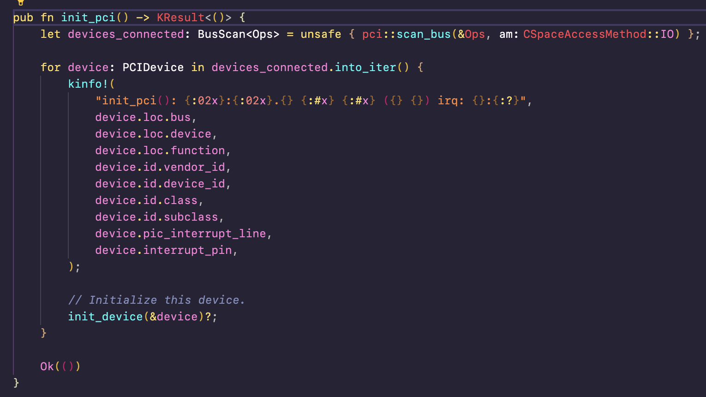

该段代码定义于kernel/src/drivers/pci_bus.rs。PCI总线上链接了网卡、SATA设备，主要功能是探测总线上的设备，之后初始化这些设备并分配MMIO、DMA等用于访问它们的内存区域。其中的init_device用于初始化，其中定义了硬盘和网卡初始化的相关函数。
* ACPI初始化 init_acpi()


该段代码定义于kernel/src/arch/x86_64/acpi.rs。ACPI是硬件启动后生成的一些硬件描述信息，与APIC应作区分。应当禁用其中包含的PIC信息（也就是APIC的前身），记录其中包含的IRQ的掩码。同时在此函数中初始化高精度时钟HEPT（qemu不支持），并初始化其他CPU核心。
* CPU其他核心启动
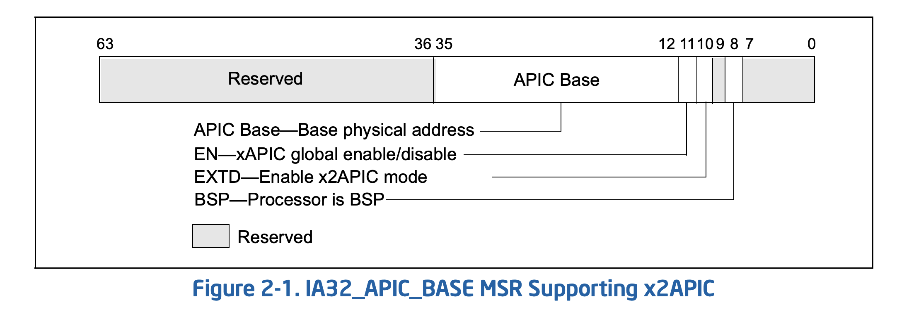

NeoOS是一个有多核心CPU操作系统。在多核心CPU模型下，默认启动的核心为Bootstrap Processor（BSP），其他核心为Application Processor（AP）。AP的启动时通过Inter-Processor Interrupt（ IPI）。具体实现步骤如下：<br>
1)发送一次INIT IPI，告知对应核心应当被唤醒<br>
2)发送一次STARTUP INIT，并等待执行，通过IPI给出的跳转指令进行跳转。其相关代码定义于kernel/src/arch/x86_64/boot/ap_trampoline.S<br>
3)其他核心进入初始化并启动成功<br>
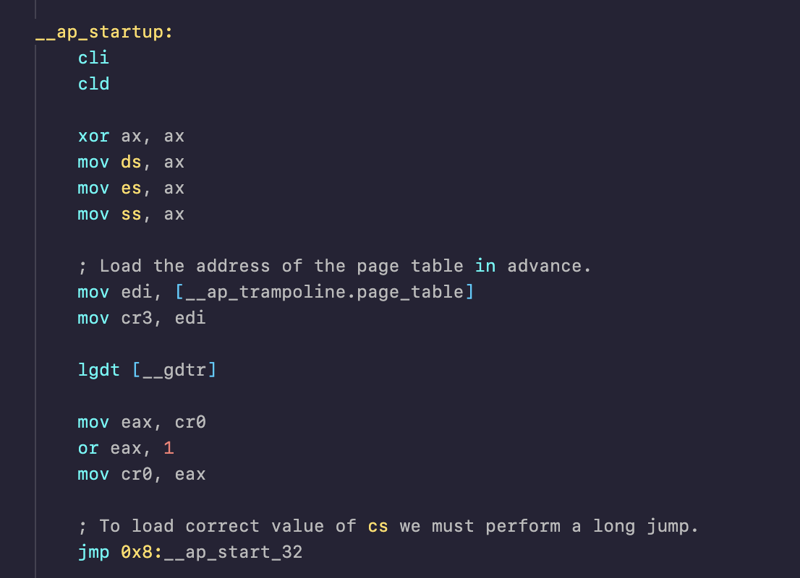

实模式->平坦模式->保护模式->设置64位GDT->进入kernel_start

## NeoOS内核组件说明
### 虚拟内存管理
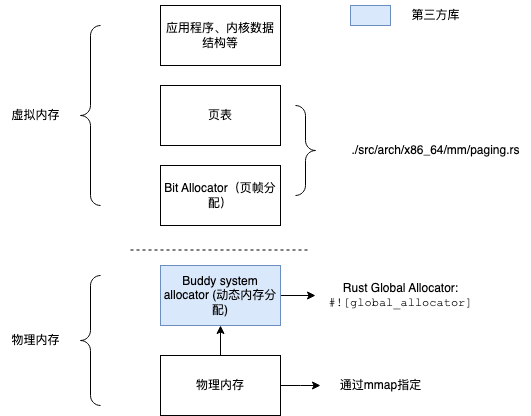

* x86_64架构下的页表相关代码定义于
kernel/src/x86_64/mm/paging.rs
* 内核管理用户虚拟内存定义于kernel/memory.rs和kernel/src/mm/mod.rs,callback.rs
### APIC
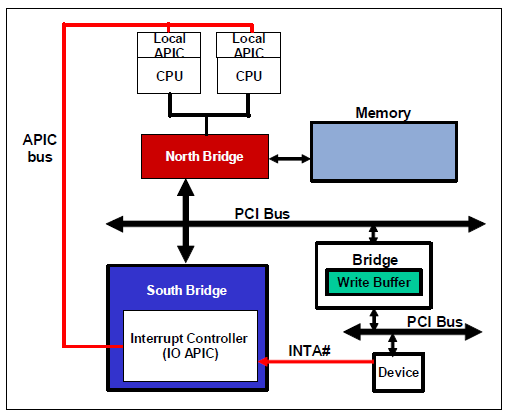

相关代码定义于kernel/src/arch/x86_64/apic。其中，IOAPIC负责将IRQ和中断分发给对应核心；LAPIC是每个CPU核心所对应的APIC，Intel目前所采用的是x2APIC架构，在此之前则采用xAPIC架构。
### 同步原语
相关代码定义于kernel/src/sync。相关代码实现了如下机制：
* 基于自旋的互斥锁（mutex.rs），支持屏蔽中断和允许中断。
* 快速用户空间的互斥锁(futex.rs)。
* Raw Mutex。暂时未在NeoOS中使用，可用来实现类似条件变量的机制，之后将进制挂起到parking lot。
* Rust中实现同步以及所有权限的一些问题<br>
1)全局变量<br>


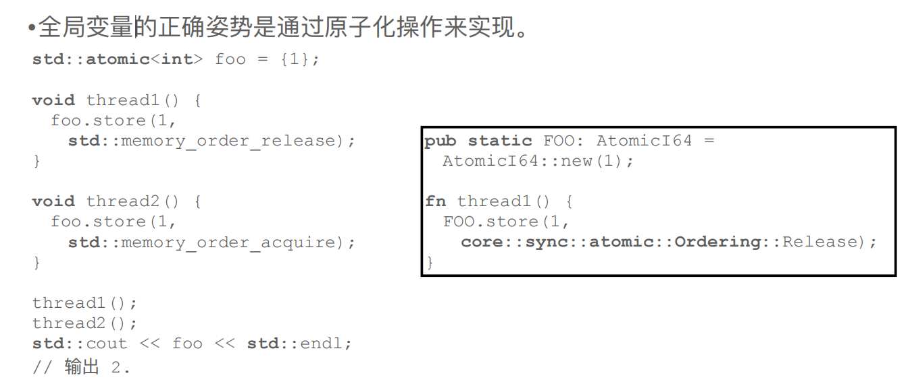

2)全局变量多线程共享所有权问题<br>
Rust Compiler不知何时应当drop，也无法保证安全<br>
解决方案：使用引用计数器并加上原子操作。通常使用arc+锁进行操作(arc也就是atomic reference couting)。<br>
也会使用lazy_static的方式初始化，以此可以减少rodata和bss段的大小.
### signal
相关代码定义于kernel/src/signal/mod.rs，用于实现和unix一样的信号处理机制。
### 进程/线程
相关代码定义于kernel/src/process。<br>
进程和线程大体上很相近，区别有：<br>
* 线程共享内存，但具有单独的寄存器
* 线程共享文件对象
* 线程有单独的信号处理机制
* 进程统一管理虚拟内存<br>
在该目录下，mod.rs是进程代码，thread.rs是线程代码，scheduler.rs实现了简单的先进先出的线程调度器。<br>
进程和线程的虚拟内存段的分配单位是arena，每段内存会有一个callback来辅助实现内存页的映射、换进换出、缺页中断处理等等。ELF文件映射通过kernel/src/elf.rs实现。


### 文件系统和虚拟文件系统
相关代码定义于kernel/src/fs。实现了以下功能：
* Apple Filesystem（只读，内存写）
* rCore Simple Filesystem（支持读写）
* /dev 设备虚拟文件系统（fs/devfs）
* /proc 进程相关文件系统，可用于获取内存映射等进程对应的元数据（fs/proc）<br>
文件对象为fs/file.rs，与unix一样做了抽象。文件系统的filesystem和Inode的抽象层使用trait设计。
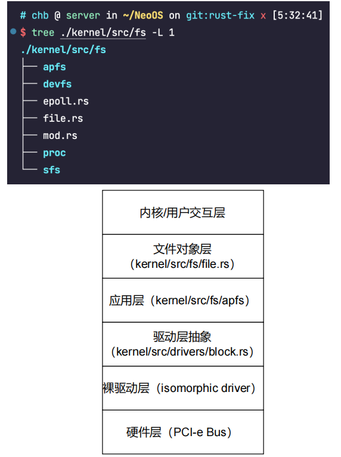

### 网络栈
相关代码定义于kernel/src/net。实现了以下功能：
* TCP sochet
* UDP socket
* Raw socket<br>
网络的socket使用trait实现，底层实现采用了smoltcp第三方库，文档为：
```sh
https://docs.rs/smoltcp/latest/
smoltcp
```
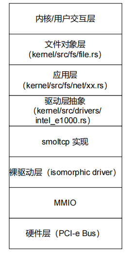

硬件层自rcore的crate修改而来，代买实现位于：kernel/src/drivers/
isomorphic_drivers/net/ethernet/intel/e1000.rs
## 其他
### Rust自带文档
执行以下命令
```shell
cargo doc --no-deps --target-dir-doc
```
生成到doc文件夹，之后可以在浏览器打开Index.html进行查看。
### 有帮助的网站
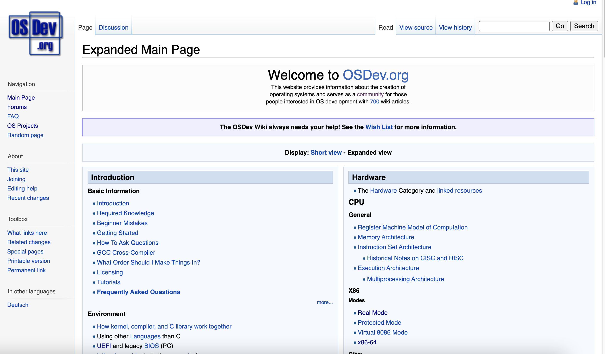

一些常见问题可以进入此网站进行查询。
## 本项目同步开源地址
项目同时开源在[本项目的支持者的github](https://github.com/hiroki-chen/NeoOS)
## 一些项目运行截图


# A Simple Operating System Kernel for Educational Purposes

## Screenshots


This kernel is built with Rust (nightly channel); you must install the corresponding toolchain first. Also, the emulator QEMU must be installed, and KVM support should be enabled (you may also need to add yourself into KVM group and then do `su - $USER`).

## Build Rust Documentations

You can get the documentation via

```shell
cargo doc --target-dir=doc --no-deps
```

which outputs the doc to `./doc/doc` where you can check the documentation by the crate name. For example, you want to check `kernel`'s doc, you may open `./doc/doc/kernel/index.html`.

## UEFI and Bootloader

This kernel can boot itself by the UEFI provided by the `uefi-rs` crate. The UEFI support allows us to conveniently use some basic OS-like tools to do some pre-boot preparations. For example, we can use the simple filesystem to load the kernel image from the disk into the main memory. Also, note that the page table mapping in the UEFI environment is *identical*; that is, the physical address is its virtual address. The NeoOS kernel will remap its component and build a new page table for itself. Then it maps the old virtual address into the kernel range.

Eventually, the kernel flushes the `CR3` register by writing the new page table into it and then performs a jump into the kernel entry `_start` defined in `kernel/src/lib.rs`. The metadata (e.g., ACPI table, memory maps) will be stored in a bootheader and then passed to the kernel.

## Memory Management

Similar to Linux kernel, the NeoOS kernel uses the bit allocator (a.k.a., the buddy system allocator) to manage the kernel-level memory allocation, too. However, the heap allocator (beneath the buddy system allocator) is implemented by an external crate and is enabled as global allocator in `kernel/src/lib.rs` by `#[global_allocator]` configuration. The initial heap is a static mutable array (for the ease of use), so it is `unsafe`.

## Logging and Panic

The kernel implements logging system by redirecting all the relevant macros (i.e., `println!, print!, log::info!`, etc.) to the serial port 0x3f8 whose outputs will be captured by the QEMU emulator. We also support Rust's builtin panic handlers `panic!, unimplemented!(), todo!(), assert*!`. If unrecoverable errors occur, the kernel will print the stack trace to enable debugging with gdb.

## Debugging with GDB

We support debugging with GDB. To do so, make sure you build the kernel by

```sh
$ su - $USER
$ make run DEBUG=1 OS_LOG_LEVEL=DEBUG
Formatting 'disk.img', fmt=qcow2 size=10737418240 cluster_size=65536 lazy_refcounts=off refcount_bits=16
```

One then launches another shell session and attach the kernel to the GDB debugger.

```sh
$ sudo gdb target/x86_64/debug/kernel # Load debug information
>>> GDB outputs

target remote :1234
```

## Some TODOs

* ~~Implement keyboard drivers. (QEMU --> serial --> ? some sort of tty)~~
* Add support for graphic cards.
* Fix multi-core scheduling:
  * Strange page fault address (e.g., 0x0, 0x8).
  * No thread running.
  * Memory corrupted (e.g., B-Tree panics when visiting nodes). Perhaps due to lock problems.
* Implement more device drivers.
* Reduce memory consumption.
* Refactor the user-space thread management (perhaps using bumpalo-like memory management); the current implementation is mimicked after rCore's implementation.
* Fix memory permission check for syscalls.
* Fix segfault for dylib loading.

## Advanced Programmable Interrupt Controller (APIC)

Intel introduced APIC after Pentium P54C CPU to enable more advanced and customable interrupt configurations. APIC consists of two major components: IOAPIC that **dispatches** interrupts, and LAPIC (Local APIC) for each core to handle the interrupt. After the target CPU finishes processing, it sends EOI to the ISR.

The IOAPIC register can be accessed by the physical address 0xffc00000, and one can verify the default address via the ACPI table obtained by the bootloader. You may need to map the address to a virtual address first.

LAPIC, in fact, handles all interrupts including the interrupt issues by the current core, that from IOAPIC, and IPI (Inter-Processor Interrupt) from other LAPICs.

## Apple Filesystem Support for Linux

Additionally, you can install `mkfs.apfs` via this link: <https://github.com/linux-apfs/linux-apfs-rw.git>. This allows one to create an APFS filesystem image on Linux platforms. For example, you can create an image `apfs.img` by

```sh
$ dd if=/dev/zero bs=1M count=400 > apfs.img
400+0 records in
400+0 records out
419430400 bytes (419 MB, 400 MiB) copied, 0.355215 s, 1.2 GB/s
$ mkfs.apfs apfs.img
$ file apfs.img
apfs.img: Apple File System (APFS), blocksize 4096
```

Then you can convert it to QCOW2 file format:

```sh
$ qemu-img convert -f raw apfs.img -O qcow2 apfs.img.qcow2
$ qemu-img resize apfs.img.qcow2 +1G
Image resized.
```

I have checked the correctness of the this tool using my own Rust library for APFS parsing.

## Running NeoOS on macOS

Yes, this kernel can be run on macOS! So one can easily use MacBook to do some tests. The following steps illustrate how to prepare necessary build and execution environment for you Mac. Note however, that compatibility on M1/M2 Macs is not tested.

* Install homwbrew if you do not have it.
* Install qemu on Mac via homwbrew.
* Install musl-gcc-cross for macOS:

```sh
brew install filosottile/musl-cross/musl-cross
```

* Execute the shell script to install musl micro runtime:

```sh
chmod +x ./prepare_darwin.sh
./prepare_darwin.sh
```

* Install `nasm` via homebrew.
* Install rust toolchain if you do not have it. This is done by:

```sh
curl --proto '=https' --tlsv1.2 -sSf https://sh.rustup.rs | sh
echo 'source $HOME/.cargo/env' >> ~/.zshrc # or ~/.bashrc
rustup -V
rustup component add rust-src llvm-tools-preview --toolchain `cat rust-toolchain`-x86_64-apple-darwin
```

That's it.

# 获奖信息
大赛官网[公示](https://os.educg.net/#/index?TYPE=OS_G)


